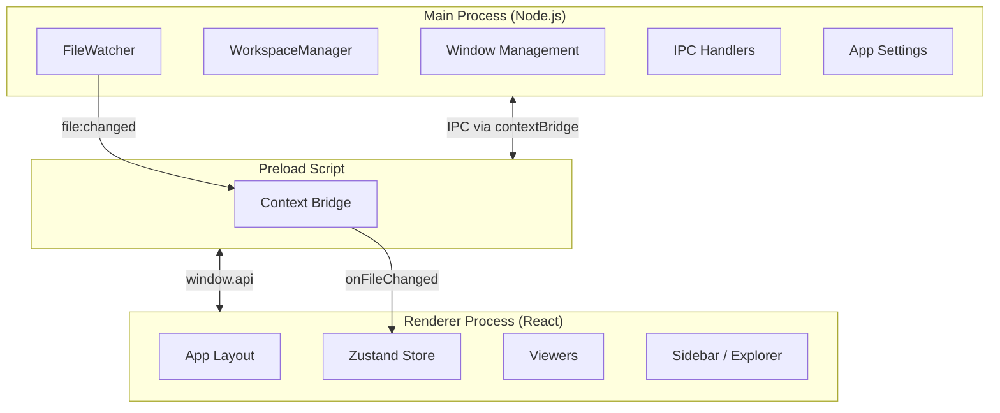
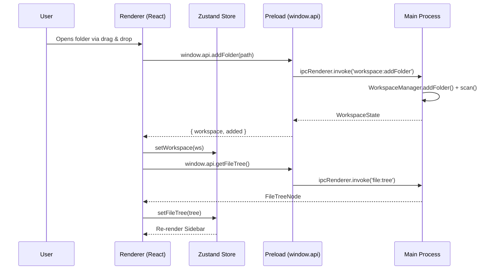
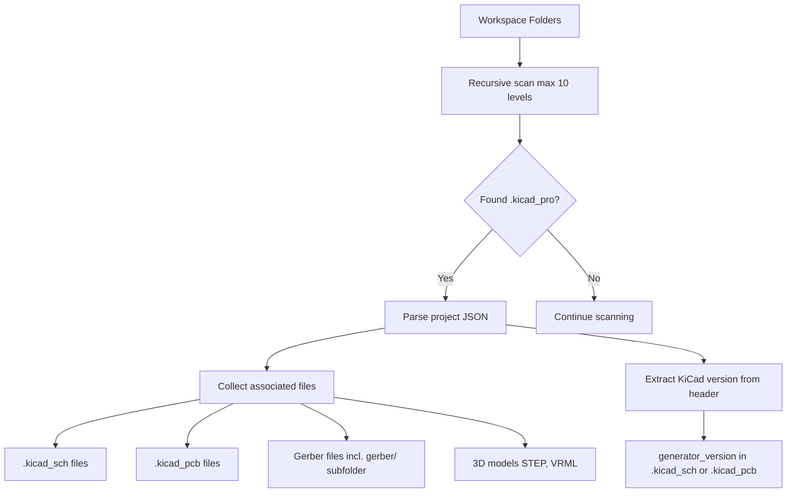
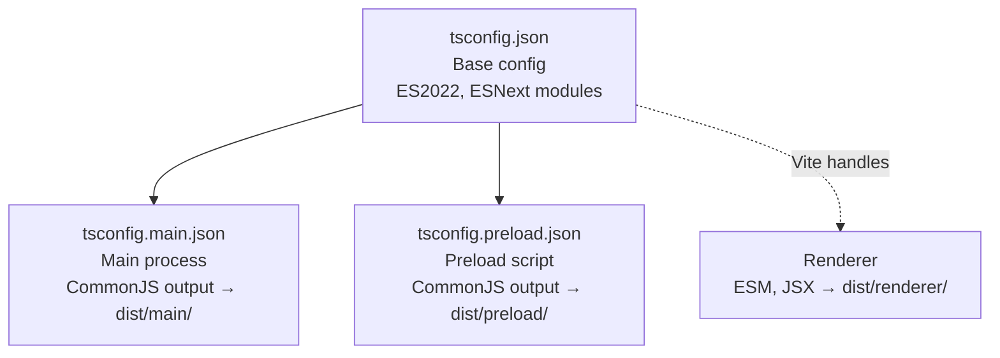
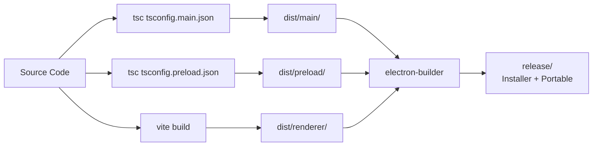

# Architecture Overview

KiCad Project Manager is a desktop application built on Electron with a three-process architecture.

---

## Process Model



| Process | Technology | Role |
|---------|-----------|------|
| **Main** | Node.js (CommonJS) | File system access, workspace management, native dialogs, window controls |
| **Preload** | CommonJS, sandboxed | Bridges main ↔ renderer via `contextBridge` |
| **Renderer** | React 19 (Vite ESM) | UI rendering, state management, file viewers |

---

## Data Flow



---

## Workspace Format

Workspaces are saved as `.kicadws` JSON files:

```json
{
  "version": 1,
  "folders": [
    "D:/Projects/PowerSupply",
    "D:/Projects/MotorController"
  ],
  "excludedProjects": [],
  "settings": {
    "theme": "dark",
    "gridSize": 1.27
  },
  "kicadFilter": false
}
```

| Field | Description |
|-------|-------------|
| `version` | Format version (always `1`) |
| `folders` | Absolute paths to project directories |
| `excludedProjects` | Directories to skip during project scanning |
| `settings` | Project-level settings (theme, grid, KiCad path, etc.) |
| `kicadFilter` | If `true`, sidebar only shows KiCad-related files |

---

## Project Scanning

When a workspace is opened or refreshed, each folder is recursively scanned for `.kicad_pro` files:



**Scanning rules:**
- Max recursion depth: 10 levels
- Skips directories starting with `.` (hidden) and `node_modules`
- Checks exclusion list to skip unwanted projects
- Deduplicates projects by directory path

---

## File Type System

Every opened file is classified by its extension into a `KicadFileType`:

| Type | Extensions | Viewer |
|------|-----------|--------|
| `schematic` | `.kicad_sch` | SchematicViewer (Canvas) |
| `pcb` | `.kicad_pcb` | PcbViewer (Canvas) |
| `project` | `.kicad_pro` | ProjectInfoViewer |
| `symbol-lib` | `.kicad_sym` | TextViewer |
| `footprint` | `.kicad_mod` | TextViewer |
| `gerber` | `.gbr`, `.gtl`, `.gbl`, `.gts`, `.gbs`, `.gto`, `.gbo`, `.gtp`, `.gbp`, `.gm1`, `.gko`, `.drl`, `.xln` | GerberViewer (Canvas) |
| `3d-model` | `.step`, `.stp`, `.wrl`, `.vrml` | ModelViewer3D (Three.js) |
| `pdf` | `.pdf` | PdfViewer (iframe) |
| `image` | `.png`, `.jpg`, `.jpeg`, `.gif`, `.bmp`, `.webp`, `.svg`, `.ico` | ImageViewer |
| `markdown` | `.md`, `.markdown` | MarkdownViewer |
| `unknown` | everything else | TextViewer (fallback) |

---

## TypeScript Configuration

The project uses three TypeScript configurations:



| Config | Includes | Module | Output |
|--------|----------|--------|--------|
| `tsconfig.json` | All `src/**/*` | ESNext | — (base only) |
| `tsconfig.main.json` | `src/main/` + `src/shared/` | CommonJS | `dist/main/` |
| `tsconfig.preload.json` | `src/preload/` + `src/shared/` | CommonJS | `dist/preload/` |
| Renderer (Vite) | `src/renderer/` + `src/shared/` | ESM | `dist/renderer/` |

---

## Build Pipeline



---

## Security Model

- `contextIsolation: true` — Renderer cannot access Node.js APIs directly
- `nodeIntegration: false` — No `require()` in renderer
- `sandbox: false` — Preload script needs `webUtils` for drag & drop path resolution
- All file system access happens exclusively through well-defined IPC channels
- Production CSP: `default-src 'self'; script-src 'self'; style-src 'self' 'unsafe-inline'`
