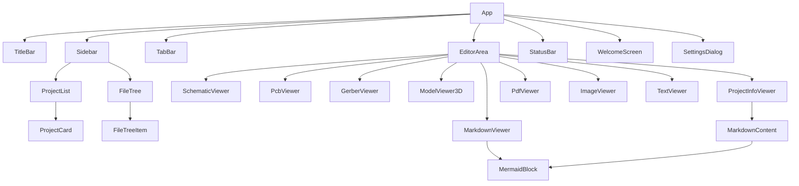

# Component Reference

This document describes every React component in the KiCad Project Manager.  
All components live under `src/renderer/components/`.

---

## Layout Components

### App (`App.tsx`)

Root component that orchestrates the entire UI layout.

```
┌──────────────────────────────────────────┐
│ TitleBar                                 │
├────────────┬─────────────────────────────┤
│  Sidebar   │  TabBar                     │
│            ├─────────────────────────────┤
│            │  EditorArea / WelcomeScreen │
│            │                             │
├────────────┴─────────────────────────────┤
│ StatusBar                                │
└──────────────────────────────────────────┘
```

| Feature | Detail |
|---|---|
| Theme application | Sets `data-theme` attribute on `<html>` |
| Sidebar resize | Mouse-drag handle between sidebar and main area (180–600 px) |
| Drag & drop | Folders dropped anywhere in the window are added to the workspace |
| Collapsible editor | When `editorPanelVisible` is false, main area shows a thin "Vorschau" strip |
| Workspace restore | Loads the last-used workspace on mount via `window.api.getWorkspace()` |

---

### TitleBar (`TitleBar.tsx`)

Custom frameless window title bar with full menu system and window controls.

#### Menu System

Menus are defined declaratively via `buildMenus()` and rendered as dropdown panels:

| Menu | Notable Actions |
|---|---|
| **File** | New / Open / Recent / Close workspace, Save, Save All, Save As, Close Tab, Exit |
| **Edit** | Undo, Redo, Cut, Copy, Paste *(currently disabled)* |
| **View** | Toggle Sidebar (`Ctrl+B`), Toggle Bottom Panel (`Ctrl+J`), Toggle Theme, Zoom |
| **Tools** | Open in KiCad (`F5`), Refresh Workspace, Settings |
| **Help** | About, Keyboard Shortcuts |

The `executeAction()` function maps action IDs to store mutations and IPC calls.

#### Features

- **Submenu support** — "Recent Workspaces" shows a hover-triggered nested submenu
- **Keyboard shortcuts** — Global `keydown` listener handles `Ctrl+O`, `Ctrl+S`, `Ctrl+Shift+S`, `Ctrl+W`, `Ctrl+B`, `Ctrl+J`
- **Theme toggle button** — Sun/Moon icon in window controls
- **Window controls** — Minimize, Maximize, Close (uses `window.api.*Window()`)
- **Workspace title** — Shows workspace name (or "Untitled") with dirty indicator `*`

---

### Sidebar (`Sidebar.tsx`)

Left panel with two switchable views: **Projects** and **Files**.

#### Header Controls

| Button | Function |
|---|---|
| `FolderPlus` | Add folder to workspace via native dialog |
| `Filter` | Toggle KiCad-only filter (persisted to workspace) |
| `ChevronsDownUp` | Collapse all tree nodes |
| `RefreshCw` | Re-scan workspace and rebuild file tree |
| `PanelRightClose` / `PanelRightOpen` | Toggle editor panel visibility |

#### Projects View (`ProjectList` → `ProjectCard`)

Displays detected KiCad projects as clickable cards.

**ProjectCard features:**
- Project name and directory path
- File count badges: `SCH`, `PCB`, `GBR`, `3D`, `MD`
- Click opens the `.kicad_pro` in the ProjectInfoViewer
- Badge click opens the first file of that type directly
- MD badge prioritizes `README.md` (case-insensitive) over other `.md` files
- Context menu: Open in KiCad, Open in Explorer, Remove from Workspace

#### Files View (`FileTree` → `FileTreeItem`)

Recursive tree showing the workspace folder hierarchy.

- **KiCad filter** — When enabled, only shows directories containing KiCad-relevant files  
  Relevant extensions are defined in `KICAD_FILTER_EXTENSIONS` (38 extensions)
- **File icons** — Mapped via `getFileIcon()` using lucide-react icons
- **File type coloring** — CSS classes for schematic, PCB, gerber, PDF, image files
- **Version badge** — Shows the KiCad version on `.kicad_pro` files and their parent directories
- **Removable roots** — Folders can be removed when the workspace has multiple folders
- **Context menu** — Open in KiCad, Open in Explorer
- **Collapse counter** — Incremented to force all nodes closed

#### Drag & Drop

The sidebar accepts dropped folders and adds them to the workspace via `window.api.addFolder()`.

---

### TabBar (`TabBar.tsx`)

Horizontal tab strip displayed above the editor area.

| Feature | Detail |
|---|---|
| File type icons | Color-coded icons per `KicadFileType` (green=SCH, blue=PCB, yellow=GBR, purple=3D) |
| Middle-click close | `onMouseDown` with `button === 1` closes the tab |
| Dirty indicator | Orange dot when `tab.isDirty` is `true` |
| Close button | X button with `stopPropagation()` to prevent tab activation |

---

### EditorArea (`EditorArea.tsx`)

Content routing component that renders the appropriate viewer for the active tab.

- **Lazy loading** — All 9 viewers are loaded via `React.lazy()` with `Suspense` fallback
- **Content loading** — Reads file content via `window.api.readFile()` when a tab becomes active
- **Routing** — `renderViewer()` maps `fileType` strings to viewer components

| `fileType` | Viewer Component |
|---|---|
| `schematic` | `SchematicViewer` |
| `pcb` | `PcbViewer` |
| `gerber` | `GerberViewer` |
| `3d-model` | `ModelViewer3D` |
| `project` | `ProjectInfoViewer` |
| `pdf` | `PdfViewer` |
| `image` | `ImageViewer` |
| `markdown` | `MarkdownViewer` |
| *anything else* | `TextViewer` |

---

### StatusBar (`StatusBar.tsx`)

Bottom bar displaying workspace info and active tab status.

| Segment | Content |
|---|---|
| Left | `{n} project(s)` or "No workspace" |
| Center | *(spacer)* |
| Right | File type (uppercase), Modified/Saved status, App version |

---

### WelcomeScreen (`WelcomeScreen.tsx`)

Splash screen shown when no workspace is loaded or no tab is active.

- **Logo** — `CircuitBoard` icon from lucide-react
- **Actions** — "Open Workspace" (primary) and "New Workspace" (secondary) buttons
- **Shortcuts** — Shows `Ctrl+O`, `Ctrl+S`, `Ctrl+W` hints
- Contextually adapts: when a workspace is already open, shows "Open Different Workspace"

---

### SettingsDialog (`SettingsDialog.tsx`)

Modal overlay for application settings.

| Setting | Control | Range |
|---|---|---|
| Color Scheme | `<select>` | Dark (Catppuccin Mocha) / Light (Catppuccin Latte) |
| Recent Workspaces max | `<input type="number">` | 1–50 |

- Opens when `settingsOpen` is `true` in the store
- Loads current settings via `window.api.getAppSettings()`
- Saves via `window.api.setAppSettings()`
- Closes on Escape key or backdrop click

---

## Viewer Components

All viewers live in `src/renderer/components/viewers/` and follow a common pattern:

```tsx
interface Props {
  content?: string;   // File content (text-based viewers)
  filePath: string;   // Absolute file path
}
```

Most viewers include a **toolbar** bar at the top with an "Open Externally" button and the file name.

---

### SchematicViewer (`SchematicViewer.tsx`)

**Canvas-based renderer** for `.kicad_sch` schematic files.

| Feature | Description |
|---|---|
| **S-expression parsing** | Uses `KicadSchematicParser` from `parser/schematicParser.ts` |
| **Rendered elements** | Wires, junctions, no-connects, labels (local, global, hierarchical), power symbols, symbols with pins, text, polylines, arcs, circles, rectangles, images, buses, bus entries |
| **Library symbols** | Resolves `lib_symbols` section and renders graphics + pin circles |
| **Hierarchical navigation** | Double-click a sheet block to enter sub-schematic; "Navigate Up" button to return |
| **Zoom / Pan** | Mouse wheel zoom (centered), click-drag pan |
| **Grid** | Toggleable 1.27 mm grid with Catppuccin-themed colors |
| **Modes** | Select / Edit mode toggle (edit mode placeholder) |
| **Fit View** | Auto-fits on first render; manual toolbar button |
| **Color scheme** | Uses CSS `--accent-*` variables, adapts to dark/light theme |

**Props:** `content: string`, `filePath: string`

**Lines of code:** ~891

---

### PcbViewer (`PcbViewer.tsx`)

**Canvas-based renderer** for `.kicad_pcb` board files.

| Feature | Description |
|---|---|
| **S-expression parsing** | Uses `KicadPcbParser` from `parser/pcbParser.ts` |
| **Rendered elements** | Tracks (with width), vias (drill + annular ring), pads (through-hole + SMD), footprint graphics (lines, circles, arcs, rectangles, polygons, text), board outline, zones, graphic items |
| **Layer system** | 30+ copper layers + silkscreen, mask, paste, fab, courtyard, edge cuts |
| **Layer panel** | Toggle-able side panel to show/hide individual layers |
| **Layer colors** | Catppuccin-based palette (e.g., `F.Cu` = `#f38ba8`, `B.Cu` = `#89b4fa`) |
| **Zoom / Pan** | Mouse wheel zoom, click-drag pan via refs (no React state for performance) |
| **Grid toggle** | Toggleable background grid |

**Props:** `content: string`, `filePath: string`

**Lines of code:** ~692

---

### GerberViewer (`GerberViewer.tsx`)

**Canvas-based renderer** for Gerber RS-274X files.

| Feature | Description |
|---|---|
| **Parser** | Built-in basic RS-274X parser for aperture definitions, move/draw/flash commands, region start/end |
| **Rendering** | Draws traces based on aperture shapes, flash pads, region fills |
| **Aperture support** | Circle (`C`), Rectangle (`R`), Obround (`O`) |
| **Auto-fit** | Fits view on parse completion |
| **Zoom / Pan** | Standard mouse wheel zoom + drag pan |

**Props:** `content: string`, `filePath: string`

**Lines of code:** ~264

---

### ModelViewer3D (`ModelViewer3D.tsx`)

**3D renderer** for STEP/STP and VRML/WRL files using Three.js.

| Feature | Description |
|---|---|
| **STEP import** | Uses `occt-import-js` (WASM) loaded via IPC (`window.api.getWasmBinary`) |
| **Rendering** | React Three Fiber `<Canvas>` with `OrbitControls` and `@react-three/drei` grid |
| **Mesh data** | Extracts positions, normals, indices, and per-mesh colors from OCCT result |
| **Progress indicator** | Shows loading stages: Reading → Loading parser → Initializing OCCT → Parsing |
| **Cancellation** | Cleanup flag prevents state updates after unmount |
| **Lighting** | Ambient + directional light for realistic appearance |
| **Camera** | Auto-positioned based on mesh bounding box |

**Props:** `filePath: string` *(reads file via `readFileBase64`)*

**Lines of code:** ~264

---

### ProjectInfoViewer (`ProjectInfoViewer.tsx`)

**Dashboard-style viewer** for `.kicad_pro` project files.

| Feature | Description |
|---|---|
| **Project header** | Name, directory path, folder icon |
| **Info cards** | KiCad version, last modified date, file counts (schematics, PCBs, gerber, 3D models) |
| **Colored icons** | Green for Schematics (`Cpu`), Blue for PCBs (`CircuitBoard`) |
| **Text variables** | Table of `text_variables` from the project JSON |
| **Hierarchical sheets** | Lists sheet entries from the project file |
| **Clickable file lists** | Schematic, PCB, Gerber, 3D Model files open in appropriate viewers |
| **Markdown description** | Automatically loads and renders `README.md` (or other `.md` files) from the project directory using `MarkdownContent` |
| **Open in KiCad** | Toolbar button launches KiCad with the project file |

**Props:** `content: string`, `filePath: string`

**Lines of code:** ~381

---

### MarkdownViewer (`MarkdownViewer.tsx`)

**Rich markdown renderer** for `.md` and `.markdown` files.

| Feature | Description |
|---|---|
| **Library** | `react-markdown` with `remark-gfm` plugin (tables, strikethrough, task lists, autolinks) |
| **Mermaid diagrams** | `MermaidBlock` component detects `language-mermaid` code blocks and renders via `mermaid.render()` |
| **Relative links** | `.md` links resolved against the current file's directory and opened in new tabs |
| **External links** | `https://` links opened in default browser via `window.api.openInDefaultApp()` |
| **File links** | Non-markdown relative links opened with appropriate viewer via `getKicadFileType()` |
| **Styling** | Full `.markdown-body` CSS with headings, code blocks, tables, blockquotes, lists, checkboxes |

**Exports:**

| Export | Usage |
|---|---|
| `MarkdownViewer` | Full viewer with toolbar (used by `EditorArea`) |
| `MarkdownContent` | Inline renderer without toolbar (used by `ProjectInfoViewer`) |

**Key implementation:**

```tsx
// MermaidBlock renders mermaid code as SVG
function MermaidBlock({ code }: { code: string }) { ... }

// resolveRelativePath resolves ../foo.md against base directory
function resolveRelativePath(basePath: string, href: string): string { ... }

// createMdComponents returns custom component overrides for ReactMarkdown
function createMdComponents(filePath, openTab) { ... }
```

**Props (MarkdownViewer):** `content: string`, `filePath: string`  
**Props (MarkdownContent):** `content: string`, `basePath?: string`

**Lines of code:** ~195

---

### PdfViewer (`PdfViewer.tsx`)

**Embedded PDF viewer** using the browser's built-in `<object>` element.

| Feature | Description |
|---|---|
| **Loading** | Reads file as base64 via IPC, converts to Blob URL |
| **Rendering** | Native Chromium PDF viewer embedded via `<object type="application/pdf">` |
| **Fallback** | "Open in default PDF viewer" button if embed fails |
| **Memory** | Revokes previous Blob URLs to prevent memory leaks |

**Props:** `filePath: string`

---

### ImageViewer (`ImageViewer.tsx`)

**Zoomable image viewer** for PNG, JPEG, GIF, BMP, WebP, SVG, ICO files.

| Feature | Description |
|---|---|
| **Loading** | Reads file as base64 via IPC, creates Blob URL with correct MIME type |
| **Zoom** | `Ctrl+Scroll` wheel zoom (0.1×–10×) |
| **Info display** | Shows natural pixel dimensions and current zoom percentage |
| **MIME detection** | `getMimeType()` maps file extensions to MIME types |

**Props:** `filePath: string`

---

### TextViewer (`TextViewer.tsx`)

**Plain text fallback viewer** for unrecognized file types.

| Feature | Description |
|---|---|
| **Display** | `<pre>` block with monospace font, word-break, and user-select |
| **Info** | Shows file name and character count |
| **External** | "Open Externally" button in toolbar |

**Props:** `content: string`, `filePath: string`

---

## Component Dependency Graph



---

## State Access Pattern

All components access state via `useAppStore` (Zustand).  
Direct IPC calls are made through `window.api.*` methods defined in the preload script.

```tsx
// Typical pattern
const workspace = useAppStore(s => s.workspace);
const openTab = useAppStore(s => s.openTab);
```

Components use **selector functions** to subscribe only to the state slices they need, avoiding unnecessary re-renders.
