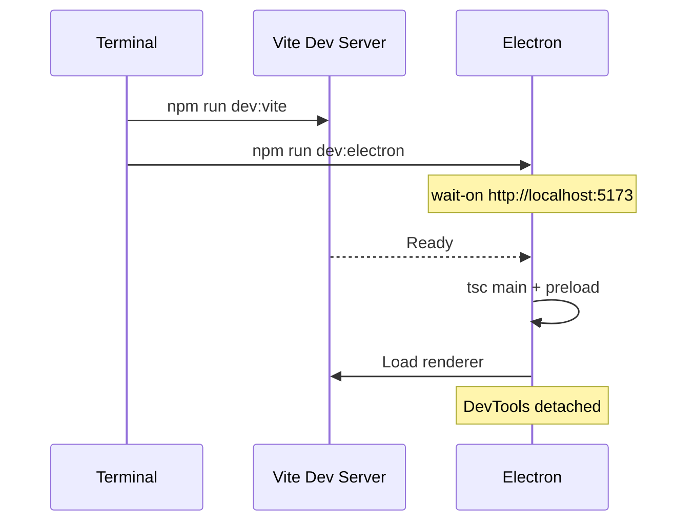
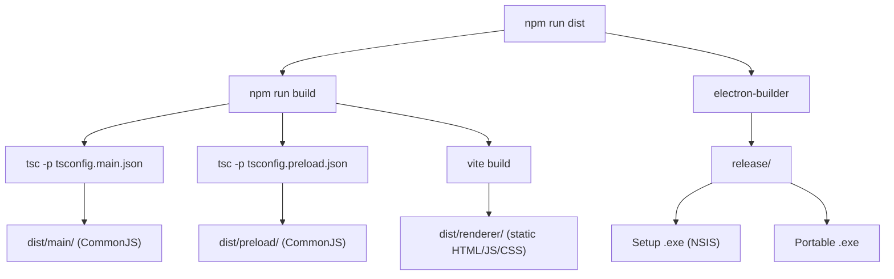

# Development Guide

This guide explains how to set up, run, debug, and extend KiCad Project Manager.

---

## Prerequisites

| Tool | Version | Purpose |
|------|---------|---------|
| [Node.js](https://nodejs.org/) | ≥ 18 LTS | Runtime and package manager |
| [Git](https://git-scm.com/) | any | Version control |
| [VS Code](https://code.visualstudio.com/) | recommended | Editor with TypeScript support |
| [KiCad](https://www.kicad.org/) | optional | For "Open in KiCad" feature |

---

## Initial Setup

### 1. Clone the repository

```bash
git clone https://github.com/<your-username>/KiCad_ProjManager.git
cd KiCad_ProjManager
```

### 2. Enable script execution (Windows only)

PowerShell may block npm scripts by default. Run this once per terminal session:

```powershell
Set-ExecutionPolicy -ExecutionPolicy RemoteSigned -Scope Process
```

### 3. Install dependencies

```bash
npm install
```

This installs all runtime and development dependencies, including:
- Electron, React, Vite, TypeScript
- Three.js + occt-import-js (WASM for STEP files)
- Mermaid, react-markdown, lucide-react

### 4. Start development mode

```bash
npm run dev
```

This runs two processes in parallel:
1. **Vite dev server** on `http://localhost:5173` (hot module replacement)
2. **Electron** loading from the dev server (with DevTools detached)



> **Note:** The `wait-on` command ensures Electron only starts after Vite is ready.

---

## Development Workflow

### File Changes

| File Changed | Action Required |
|-------------|----------------|
| `src/renderer/**` | Auto-reloads via Vite HMR |
| `src/main/**` | Restart `npm run dev` |
| `src/preload/**` | Restart `npm run dev` |
| `src/shared/**` | Restart if used in main/preload. Auto-reloads if renderer-only |
| `package.json` | Run `npm install`, then restart |

### Common Commands

```bash
# Development mode with hot-reload
npm run dev

# Type-check without building
npm run lint

# Full build (compile + bundle)
npm run build

# Build + create installer
npm run dist

# Run from compiled output
npm run start
```

---

## Build Process



### Build Outputs

| Output | Path | Description |
|--------|------|-------------|
| Main process | `dist/main/` | Compiled Node.js code |
| Preload script | `dist/preload/` | Compiled bridge code |
| Renderer | `dist/renderer/` | Bundled React app |
| Installer (Windows) | `release/*.exe` | NSIS installer |
| Portable (Windows) | `release/*.exe` | Standalone executable |

---

## Debugging

### Renderer (React)

- DevTools open automatically in dev mode (detached window)
- Use the **Console**, **Elements**, and **React DevTools** tabs
- Vite provides source maps — click on file references to open full TypeScript source

### Main Process

- Use `console.log()` statements — output appears in the terminal where `npm run dev` runs
- For VS Code debugging, add a launch configuration:

```json
{
  "type": "node",
  "request": "launch",
  "name": "Debug Main Process",
  "runtimeExecutable": "${workspaceFolder}/node_modules/.bin/electron",
  "args": ["."],
  "cwd": "${workspaceFolder}",
  "sourceMaps": true,
  "outFiles": ["${workspaceFolder}/dist/main/**/*.js"]
}
```

### Common Issues

| Problem | Solution |
|---------|----------|
| `npm run dev` fails immediately | Check that port 5173 is not already in use |
| White window on startup | Vite server not ready yet — `wait-on` should handle this |
| Changes to main process not applied | Restart `npm run dev` (no hot-reload for main) |
| WASM not loading in dev | The occt-import-js WASM is loaded from `node_modules` in dev mode |
| PowerShell script errors | Run `Set-ExecutionPolicy -ExecutionPolicy RemoteSigned -Scope Process` |

---

## Adding a New Viewer

To add support for a new file type:

### Step 1: Register the file type

In `src/shared/types.ts`, add to the `KicadFileType` union:

```typescript
export type KicadFileType = '...' | 'your-new-type' | 'unknown';
```

### Step 2: Map the extensions

In `src/shared/fileTypes.ts`, add to the `getKicadFileType()` switch:

```typescript
case '.xyz': return 'your-new-type';
```

### Step 3: Create the viewer component

Create `src/renderer/components/viewers/YourViewer.tsx`:

```tsx
import React from 'react';

interface YourViewerProps {
  content: string;
  filePath: string;
}

export function YourViewer({ content, filePath }: YourViewerProps) {
  return (
    <div className="viewer-container">
      <div className="toolbar">
        {/* Toolbar buttons */}
      </div>
      <div style={{ flex: 1, overflow: 'auto', padding: '16px' }}>
        {/* Render your content */}
      </div>
    </div>
  );
}
```

### Step 4: Register in EditorArea

In `src/renderer/components/EditorArea.tsx`:

```tsx
// Add lazy import
const YourViewer = lazy(() =>
  import('./viewers/YourViewer').then(m => ({ default: m.YourViewer }))
);

// Add case in renderViewer()
case 'your-new-type':
  return <YourViewer content={content} filePath={filePath} />;
```

### Step 5 (optional): Add to file filter

In `src/renderer/components/Sidebar.tsx`, add extensions to `KICAD_FILTER_EXTENSIONS`:

```typescript
const KICAD_FILTER_EXTENSIONS = new Set([
  // ... existing
  '.xyz',
]);
```

---

## Adding a New IPC Channel

### Step 1: Define the channel name

In `src/shared/types.ts`:

```typescript
export const IPC_CHANNELS = {
  // ...
  YOUR_CHANNEL: 'your:channel',
} as const;
```

### Step 2: Add the handler in main

In `src/main/main.ts` inside `setupIpcHandlers()`:

```typescript
ipcMain.handle(IPC_CHANNELS.YOUR_CHANNEL, async (_event, arg: string) => {
  // Handle the request
  return result;
});
```

### Step 3: Expose in preload

In `src/preload/preload.ts`:

```typescript
yourMethod: (arg: string) =>
  ipcRenderer.invoke(IPC_CHANNELS.YOUR_CHANNEL, arg),
```

### Step 4: Add type declaration

In `src/renderer/electron.d.ts`:

```typescript
export interface ElectronAPI {
  // ...
  yourMethod(arg: string): Promise<ResultType>;
}
```

### Step 5: Use in renderer

```typescript
const result = await window.api.yourMethod('hello');
```

---

## Project Conventions

### Code Style

- TypeScript strict mode enabled
- Functional React components with hooks
- Zustand for state management (no Redux, no Context)
- CSS with custom properties (variables) — no CSS-in-JS
- `lucide-react` for all icons

### Naming

| Item | Convention | Example |
|------|-----------|---------|
| Components | PascalCase | `SchematicViewer` |
| Files | PascalCase for components, camelCase for utilities | `SchematicViewer.tsx`, `appStore.ts` |
| IPC channels | `category:action` | `workspace:addFolder` |
| CSS classes | kebab-case | `sidebar-header-actions` |
| Store actions | camelCase verbs | `openTab`, `setWorkspace` |

### File Organization

- **Shared types** go in `src/shared/`
- **IPC handlers** go in `src/main/main.ts` (inside `setupIpcHandlers`)
- **Business logic** goes in dedicated manager classes (`src/main/workspaceManager.ts`)
- **Viewers** go in `src/renderer/components/viewers/`
- **Styles** go in `src/renderer/styles/app.css` (organized by section comments)
