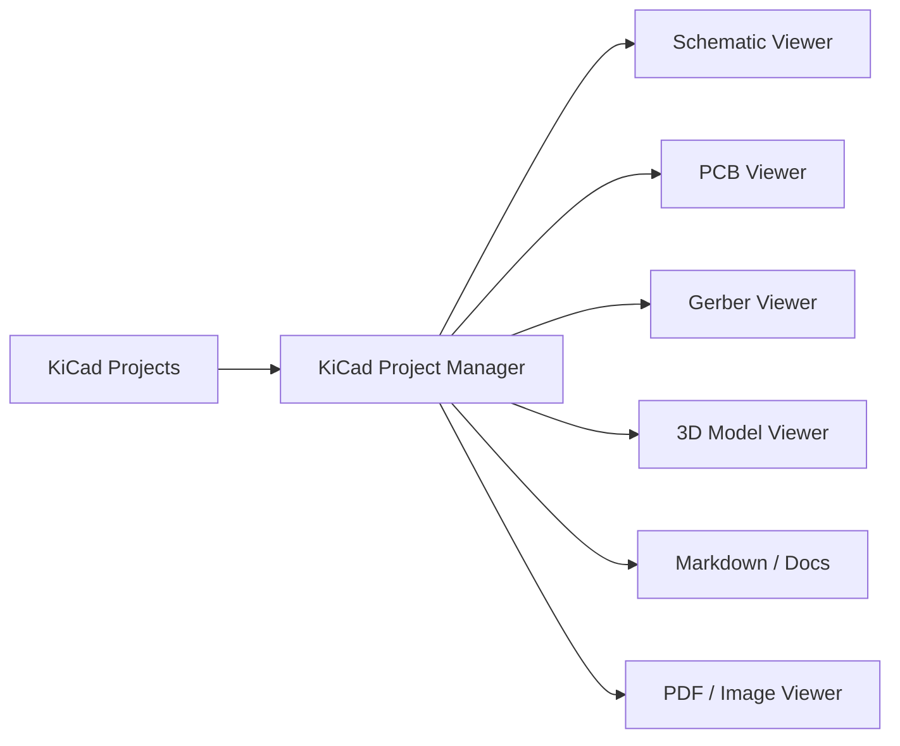
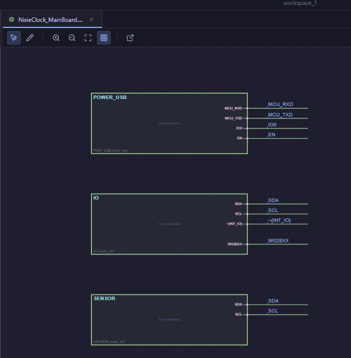
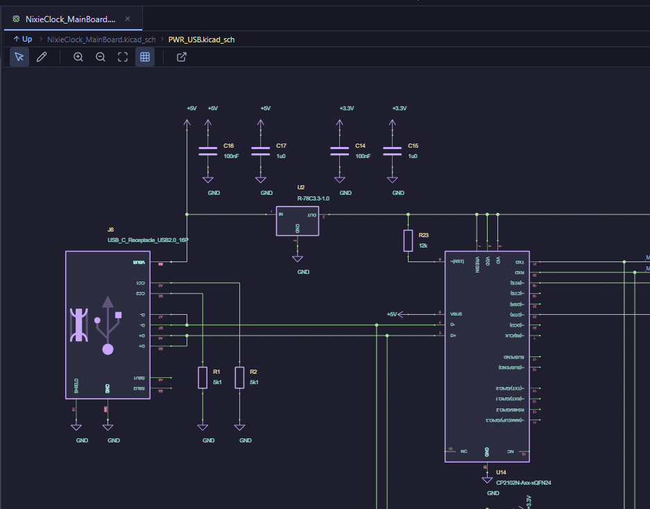
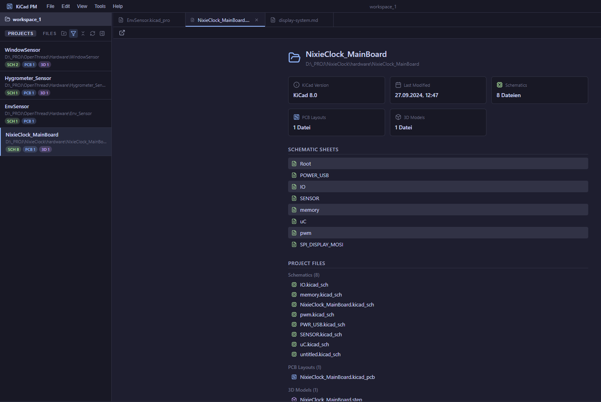
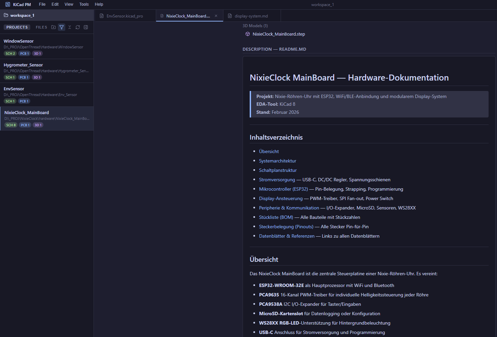
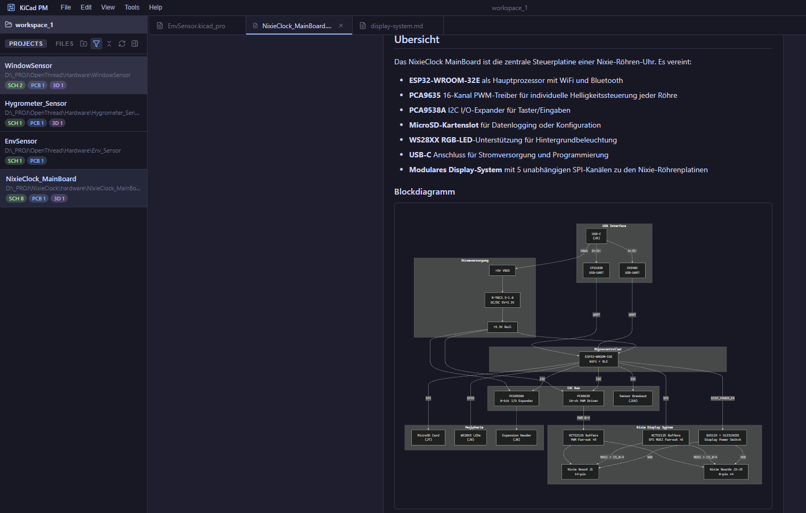
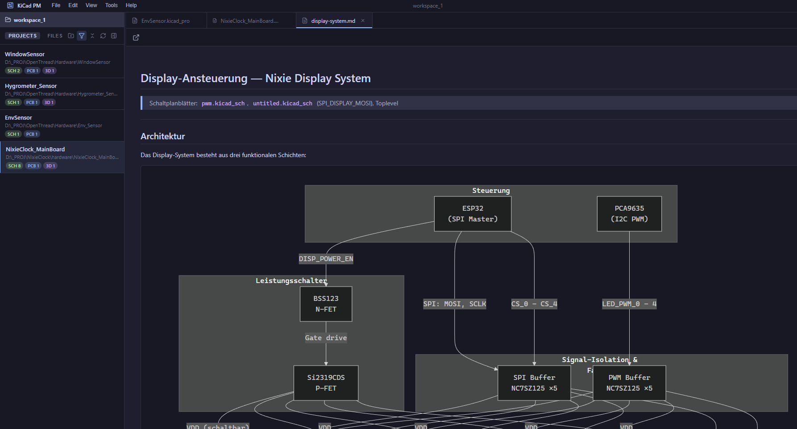

# KiCad Project Manager

A desktop application for managing KiCad electronics projects — built with Electron, React and TypeScript.

> Browse, organize, and preview your KiCad projects without leaving the app. View schematics, PCB layouts, Gerber files, 3D models, PDFs, images, and Markdown documentation — all in one place.



---

## Features

- **Workspace Management** — Group multiple project folders into a single workspace (`.kicadws` file)
- **Project Discovery** — Auto-detects `.kicad_pro` files, schematics, PCBs, Gerber, 3D models
- **Integrated Viewers**
  - KiCad Schematic (`.kicad_sch`) — canvas-based with pan/zoom
  - KiCad PCB (`.kicad_pcb`) — layer-based rendering with visibility toggles
  - Gerber (RS-274X) — built-in parser and renderer
  - 3D Models (STEP, VRML) — Three.js viewer with WASM-based STEP import
  - PDF, Images (PNG, JPG, SVG, …)
  - Markdown with Mermaid diagram support
- **Project Explorer** — collapsible editor panel for sidebar-only mode
- **Dark / Light Theme** — Catppuccin-based color scheme
- **Drag & Drop** — Drop folders anywhere to add them to a workspace
- **KiCad Integration** — Open projects directly in KiCad
- **File Watcher** — Auto-refresh on external file changes

---

## Quick Start

### Prerequisites

- [Node.js](https://nodejs.org/) v18 or newer (LTS recommended)
- [Git](https://git-scm.com/)
- [KiCad](https://www.kicad.org/) (optional — for "Open in KiCad" feature)

### Installation

```powershell
# Clone the repository
git clone https://github.com/<your-username>/KiCad_ProjManager.git
cd KiCad_ProjManager

# On Windows: allow script execution in current session (if needed)
Set-ExecutionPolicy -ExecutionPolicy RemoteSigned -Scope Process

# Install dependencies
npm install

# Start in development mode
npm run dev
```

### Build for Production

```powershell
# Build and package as installer
npm run dist
```

The installer is created in the `release/` folder.

---

## Available Scripts

| Command | Description |
|---------|-------------|
| `npm install` | Install all dependencies |
| `npm run dev` | Start development mode (Vite + Electron, hot-reload) |
| `npm run build` | Compile TypeScript and build renderer |
| `npm run dist` | Build + package with electron-builder |
| `npm run start` | Run Electron from compiled output |
| `npm run lint` | Type-check with `tsc --noEmit` |

---

## Project Structure

```
KiCad_ProjManager/
├── assets/                  # App icon, static assets
├── release/                 # Build output (installer, portable)
├── src/
│   ├── main/                # Electron main process (Node.js)
│   │   ├── main.ts          # Window creation, IPC handlers
│   │   ├── workspaceManager.ts  # .kicadws file management
│   │   └── fileWatcher.ts   # File change detection
│   ├── preload/
│   │   └── preload.ts       # Context bridge (main ↔ renderer)
│   ├── renderer/            # React frontend (Vite-bundled)
│   │   ├── App.tsx          # Root layout component
│   │   ├── main.tsx         # React entry point
│   │   ├── components/      # UI components
│   │   │   ├── TitleBar.tsx      # Custom titlebar + menu
│   │   │   ├── Sidebar.tsx       # Project/file explorer
│   │   │   ├── EditorArea.tsx    # Viewer routing
│   │   │   ├── TabBar.tsx        # Editor tabs
│   │   │   ├── StatusBar.tsx     # Bottom status bar
│   │   │   ├── WelcomeScreen.tsx # Start screen
│   │   │   ├── SettingsDialog.tsx
│   │   │   └── viewers/     # File type viewers
│   │   │       ├── SchematicViewer.tsx
│   │   │       ├── PcbViewer.tsx
│   │   │       ├── GerberViewer.tsx
│   │   │       ├── ModelViewer3D.tsx
│   │   │       ├── MarkdownViewer.tsx
│   │   │       ├── ProjectInfoViewer.tsx
│   │   │       ├── PdfViewer.tsx
│   │   │       ├── ImageViewer.tsx
│   │   │       └── TextViewer.tsx
│   │   ├── store/
│   │   │   └── appStore.ts  # Zustand state management
│   │   ├── styles/
│   │   │   ├── app.css      # Component styles
│   │   │   └── global.css   # CSS variables, theme
│   │   ├── parser/          # KiCad file parsers
│   │   └── editor/          # Editor tools (selection, commands)
│   └── shared/              # Shared between main + renderer
│       ├── types.ts         # Type definitions, IPC channels
│       ├── fileTypes.ts     # File extension mapping
│       └── index.ts
├── package.json
├── tsconfig.json            # Base TypeScript config
├── tsconfig.main.json       # Main process config
├── tsconfig.preload.json    # Preload script config
├── vite.config.ts           # Vite bundler config
└── documentation/           # Detailed documentation
    ├── architecture.md
    ├── development.md
    ├── components.md
    └── api-reference.md
```

---

## Documentation

Detailed documentation is available in the [documentation/](documentation/) folder:

- [Architecture Overview](documentation/architecture.md) — Process model, data flow, workspace format
- [Development Guide](documentation/development.md) — Setup, workflow, debugging, adding new features
- [Component Reference](documentation/components.md) — UI components and viewers
- [API Reference](documentation/api-reference.md) — IPC channels, preload API, store

---

## Tech Stack

| Layer | Technology |
|-------|-----------|
| Desktop Runtime | Electron 40 |
| Frontend | React 19, TypeScript 5.9 |
| Bundler | Vite 7 |
| State Management | Zustand 5 |
| 3D Rendering | Three.js + React Three Fiber |
| STEP Import | occt-import-js (WASM) |
| Markdown | react-markdown + remark-gfm + Mermaid |
| Icons | Lucide React |
| Packaging | electron-builder |
| Theming | Catppuccin (CSS custom properties) |

---

## Screenshots

### Schematic Viewer


### Hierarchical Navigation


### Project Info






### Markdown Viewer


---

## License

[MIT](LICENSE) — Free for personal and commercial use.

---

## Support

If you find this project useful, consider supporting its development:

[](https://paypal.me/jthiessen80)

<!-- Dies ist ein Kommentar und wird nicht gerendert
[](https://buymeacoffee.com/<your-username>)
**Crypto:**

| Currency | Address |
|----------|---------|
| Bitcoin (BTC) | `<btc-address>` |
| Ethereum (ETH) | `<eth-address>` |
-->
